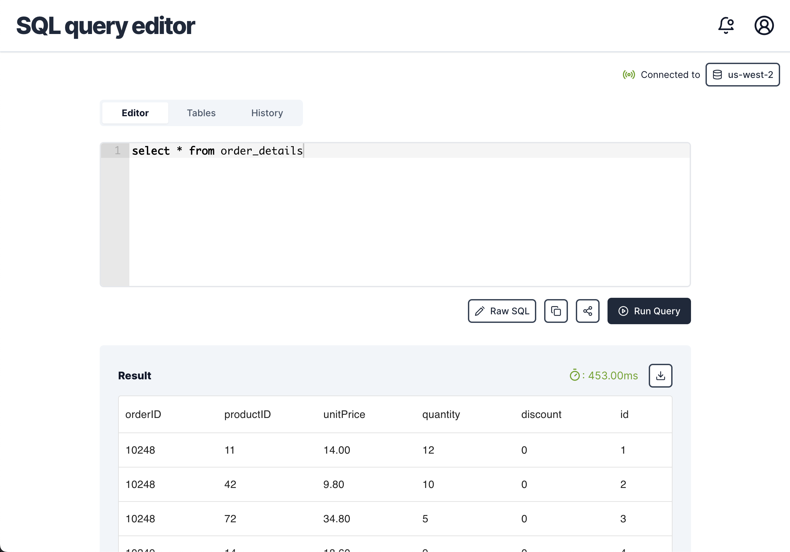
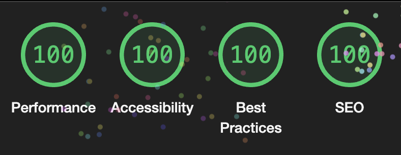

# SQL Query Editor

## Overview

Web-based application that allows users to interact with databases and execute SQL queries through a user-friendly interface. It provides a convenient way for data analysts to manage and work with databases directly from their web browsers.



## Visit App

[https://sql-editor-three.vercel.app/](https://sql-editor-three.vercel.app/)

## Tech Stack

- <b>Next.js</b>: React Framework for the application
- <b>Tailwind</b>: CSS Framework
- <b>Typescript</b>: For a better Developing experience

## Packages Used

- <b>@mui/x-data-grid</b>: Fast and extendable react data table and react data grid
- <b>@radix-ui/react-dropdown-menu</b>: Displays a menu to the user
- <b>@radix-ui/react-tabs</b>: Displays tab panels to the user
- <b>class-variance-authority</b>: For Creating variants of a UI component
- <b>clsx</b>: Utility for constructing className strings conditionally
- <b>lucide-react</b>: Icon library for react applications
- <b>papaparse</b>: CSV parser for the browser
- <b>react-ace</b>: React component for SQL Editor
- <b>react-hot-toast</b>: Notification toasts
- <b>tailwind-merge</b>: Utility function to efficiently merge Tailwind CSS classes in JS without style conflicts.

## Predefined SQL Queries

- `select * from customers`
- `select * from categories`
- `select * from employee_territories`
- `select * from order_details`
- `select * from orders`
- `select * from products`
- `select * from regions`
- `select * from shippers`
- `select * from suppliers`
- `select * from territories`

## Website Performance

Perfect Lighthouse Score for both Desktop and Mobile


### Average Page Load time calculated using Lighthouse

Desktop: <b>0.4s</b>

Mobile: <b>1.4s</b>

### Average Page Load time calculated using SpeedLab

Desktop: <b>0.4s</b>

Mobile: <b>1.2s</b>

## Setting up Development Environment

First, run the development server:

```bash
npm run dev
# or
yarn dev
# or
pnpm dev
```

Open [http://localhost:3000](http://localhost:3000) within your browser to see the result.
